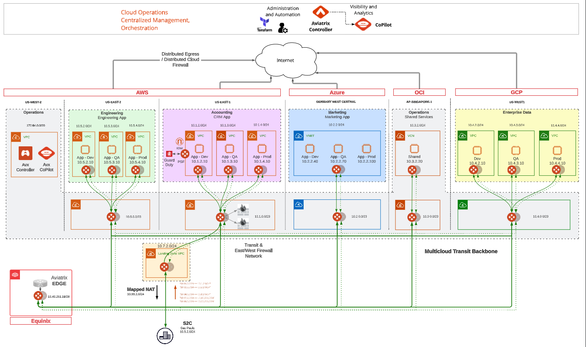

# Aviatrix Field Demo Environment

## Description

This repository contains terraform code for building the Aviatrix Field Demo Environment. This code is not intended to be a consumable model, but a reference example.

## Account Prerequisites

Two AWS marketplace subscriptions are required for the `operations` aws account, including:

- [Aviatrix Secure Cloud Networking](https://aws.amazon.com/marketplace/pp/prodview-kdzvneo7u3zko)
- [VM-Series Next-Generation Firewall (BYOL and ELA)](https://aws.amazon.com/marketplace/pp/prodview-ccntnbzdod74k)

## Diagram

_Fig. topology_

## Repository folder structure

- `platform/`
  Example terraform to deploy a secure Aviatrix control plane (Controller | CoPilot) accessible only via aws alb with waf rules enabled.
- `config/`
  Example terraform to configure the environment with rbac, secondary account iam, access accounts, sso, controller label text, etc.
- `cloud_fabric`
  Example terraform to deploy and secure multicloud networks with embedded synthetic demo traffic.

## Demonstrated use-cases

- Multicloud secure network backbone
- Distributed Cloud Firewall
- Distributed Cloud Firewall for Egress
- Network Segmentation
- Edge
- Intra-VPC SG Orchestration
- Overlapping S2C mapped NAT
- Vpn (with SAML/SSO)
